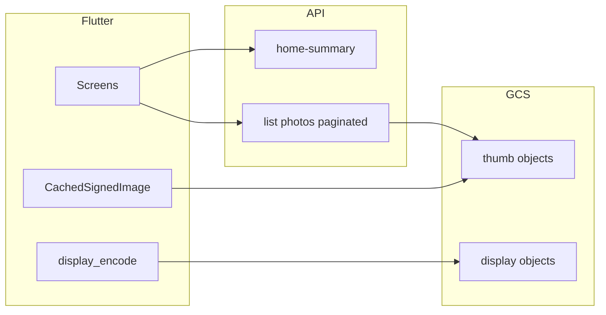

# Performance guide

How to measure La Nonna’s performance, what is already optimized in Path B, and a prioritized backlog aligned with [platform-architecture.md](platform-architecture.md). For manual checks on encode and image cache, see [pre-beta-qa.md](pre-beta-qa.md). Product offline expectations: [requirements.md](../product/requirements.md) (NFR-OFFLINE-001, FR-GAL-002).

---

## 1. Goals and constraints

**User-perceived**

- Fast tab switches and pull-to-refresh without full-screen spinners on every revisit.
- Smooth gallery scroll (thumbs from disk cache when possible).
- Responsive home after baby switch (`HomeRepository.resolveSelectedBaby`).

**Cost and scale**

- Paginated API reads, thumb-first feeds, FCM-driven refresh instead of polling ([platform-architecture.md](platform-architecture.md) principles 3–4 and 9).
- Media bytes stay off the API hot path (client encode → signed PUT → GCS; worker thumbs).

**Non-goals for v1** (see architecture doc)

- Cloud CDN, regional SQL HA, camera-original archive storage.

---

## 2. How to measure (before optimizing)

| Layer | What to use | What to watch |
|-------|-------------|---------------|
| **Flutter** | DevTools (Timeline, CPU profiler, Repaint rainbow); `flutter run --profile` | Jank on gallery grid; rebuild scope on home |
| **Firebase** | Crashlytics + Performance (architecture §2.1) | Screen traces; slow HTTP if instrumented |
| **API** | Cloud Run metrics (latency, 5xx); structured logs with request ID | p95 on `GET …/home-summary`, gallery list, `POST …/photos/init` |
| **DB** | Cloud SQL Query Insights; `EXPLAIN` on hot queries | Sequential scans on `activity_events`, `photos` |
| **GCS** | Billing egress and request counts | Ratio of thumb vs display reads |

### Baseline checklist (repeatable)

Run on a **release** or **profile** build (`--dart-define-from-file=flavors/dev.json`), not debug.

1. Cold start → sign-in.
2. Home load (time to interactive sections).
3. Gallery: scroll ~50 thumbs, scroll back (cache hit = little or no new network for same cells).
4. Calendar: change month; open upcoming.
5. Registry tab open.

Note wall time and **number of API calls** (DevTools Network, or a proxy). Compare before/after a change.

---

## 3. What is already optimized

| Area | Implementation |
|------|----------------|
| **Upload** | [`display_encode.dart`](../../apps/mobile/lib/core/media/display_encode.dart); signed PUT via API; size limits in [`storage.py`](../../services/api/src/lanonna_api/storage.py) (~2 MB display). |
| **Read (feed)** | Worker-generated thumbs; list endpoints return thumb signed URLs. |
| **Read (detail)** | Display signed URLs; TTL **900s** in storage helpers. |
| **Client cache** | [`CachedSignedImage`](../../apps/mobile/lib/core/media/cached_signed_image.dart) wraps `cached_network_image`; optional `cacheKey` and `onSignedUrlError` for URL rotation. |
| **Pagination** | Gallery [`list_photos`](../../services/api/src/lanonna_api/domain/gallery.py) (`limit` / `offset`); home activity [`home_activity_screen.dart`](../../apps/mobile/lib/features/home/presentation/home_activity_screen.dart) with API `limit` 1–50; `home-summary` teasers capped in [`home.py`](../../services/api/src/lanonna_api/domain/home.py) (e.g. recent/favorite photos, registry highlights). |
| **Notifications** | FCM + inbox; avoid tight polling loops. |
| **Abuse / cost** | Rate limit middleware on photo-init and invite batch ([`rate_limit.py`](../../services/api/src/lanonna_api/middleware/rate_limit.py)). |
| **Post-commit notify** | [`safe_enqueue_fan_out`](../../services/api/src/lanonna_api/domain/notifications.py) so Pub/Sub failures do not fail HTTP after DB commit. |



---

## 4. Improvement backlog

Prioritized by impact and fit with existing architecture. Pick one item per cycle (see §5).

### P0 — High impact, low architectural risk

1. **Stable image cache keys everywhere**  
   Use `cacheKey: 'photo-${id}'` (or announcement id) on all `CachedSignedImage` sites so 900s URL rotation does not bust disk cache. Refetch metadata only on `onSignedUrlError` when needed (gallery already documents this pattern in [building-the-app.md](building-the-app.md)).

2. **Reduce redundant API on tab focus**  
   Audit screens that reload full lists on every `initState` or repository listener. Prefer pull-to-refresh via [`ShellTabLayout`](../../apps/mobile/lib/features/shell/presentation/shell_tab_layout.dart) and short-lived in-memory cache on repositories where safe.

3. **Calendar AI suggestions dedupe**  
   [`event_ai_suggestions_screen.dart`](../../apps/mobile/lib/features/calendar/presentation/event_ai_suggestions_screen.dart) calls `listEvents(baby.id)` without month/upcoming filter. Prefer a lightweight API (e.g. list `catalog_suggestion_id` only) or a filtered query so dedupe does not pull full event history.

4. **`home-summary` payload weight**  
   Single response drives owner home. If profiling shows slow JSON or signing, consider splitting optional teasers vs full activity, or optional field selection on the API—keep routers thin and logic in domain.

### P1 — Flutter UI

- Use `ListView.builder` / slivers for long lists; avoid unbounded `Column` of heavy children on home.
- Gallery grid: explicit `width` / `height` on `CachedSignedImage`; tune `cacheExtent` if needed.
- Defer heavy sub-route work until first navigation (shell tabs already limit concurrent tab loads).

### P1 — API / SQL

- Always pass `LIMIT` on list endpoints; add indexes with new filters ([migrations/README.md](../../infra/db/migrations/README.md)).
- Profile `build_home_summary` for N+1 signed URL work; batch or lazy-sign if CPU spikes.
- Keep notify enqueue best-effort after commit (do not block user mutations on Pub/Sub).

### P2 — Network and offline (NFR-OFFLINE-001)

- [`ConnectivityService`](../../apps/mobile/lib/core/network/connectivity_service.dart): one offline banner; show cached thumbs where possible; avoid per-section error spam.
- Coalesce duplicate `resolveSelectedBaby` + feature fetches when opening a screen.

### P2 — Ops / release

- Benchmark **release** APK (`flutter build apk --release --dart-define-from-file=flavors/dev.json`).
- Run Maestro smoke after perf-sensitive changes; CI runs `flutter analyze` + `flutter test` ([`.github/workflows/ci.yml`](../../.github/workflows/ci.yml)).

### P3 — Future

- Cloud CDN when egress justifies cost.
- Follower multi-baby aggregation (on hold): design aggregated feeds with strict pagination.
- Optional `owner_update_markers` (PRD data model) only if pull-to-refresh is insufficient.

---

## 5. One improvement cycle

1. Choose one backlog item; define a metric (e.g. home time-to-interactive, gallery scroll FPS).
2. Measure baseline in profile/release.
3. Implement the smallest change that respects [platform-architecture.md](platform-architecture.md) (Postgres via API, thin HTTP / fat domain, media off hot path).
4. Re-measure; add a line under **Changelog** below.

---

## 6. Related commands

```bash
# Mobile profile run
cd apps/mobile && flutter run --profile --dart-define-from-file=flavors/dev.json

# Mobile tests
cd apps/mobile && flutter analyze && flutter test

# API tests
cd services/api && PYTHONPATH=src .venv/bin/python -m pytest -q tests

# Dev prerequisite gate (includes analyze + test)
./scripts/verify-dev-prerequisites.sh
```

---

## Changelog

| Date | Change |
|------|--------|
| 2026-10-03 | Initial performance guide (measurement, inventory, backlog). |
