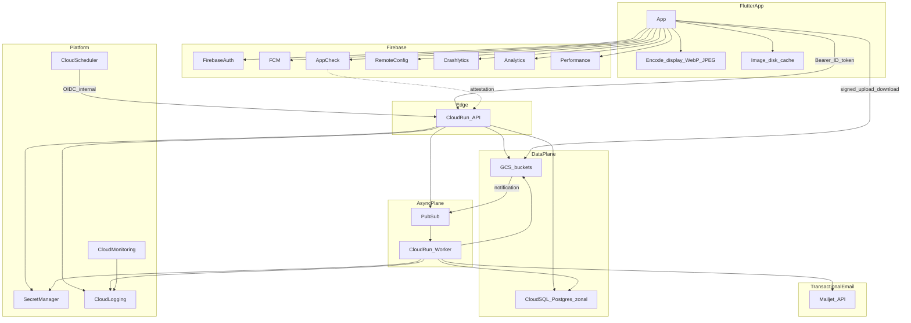

# La Nonna — platform architecture (GCP)

**Document version:** 1.6  
**Last updated:** 2026-09-29  
**Location:** `docs/engineering/platform-architecture.md` (this repository)  
**Status:** Target platform architecture for greenfield build

**Dev implementation status:** Operational gate and what is already running on `lanonna-dev` are in [building-the-app.md](building-the-app.md) and [initial-setup.md](initial-setup.md). This doc stays the long-term design reference; the playbook below mixes **done (dev)** and **still to build**.

---

## 1. Purpose and decisions

**Path B** is the stack for a relational, GCP-first, cost-conscious La Nonna app with a **production-shaped** architecture from day one (not a prototype that must be rewired at scale).

| Choice | Rationale |
|--------|-----------|
| **Flutter** | Mobile UI; feature-first screens and onboarding-step design patterns |
| **Firebase Auth** | Identity; ID tokens for API; auth lifecycle email via Firebase |
| **FCM** | Push notifications |
| **Cloud SQL (PostgreSQL, zonal)** | Relational source of truth; migrations; constraints |
| **Cloud Run (API)** | HTTP surface: JWT verification, authorization, CRUD, signed GCS URLs |
| **GCS** | **Display** assets (phone-quality) + **feed thumbnails**; client uploads display file only |
| **Pub/Sub + async worker** | Durable thumb generation and email side effects |
| **Secret Manager** | Credentials and provider keys (never in the app or images) |
| **Mailjet** (v1) | Product transactional mail (invites); swappable via adapter |

**Architecture principles (non-negotiable):**

1. **Postgres is never exposed to the client** — all data access through the API with server-side permission checks (explicit roles per baby membership).
2. **Thin HTTP, fat domain** — handlers validate input; domain services enforce rules; SQL in repositories with parameterized queries.
3. **Media off the API hot path** — bytes flow **client encode → signed URL → GCS**; API only mints URLs and metadata rows (no camera originals in v1).
4. **Phone-quality display, not archive originals** — Flutter resizes/encodes before upload; worker only builds **feed thumbs** from the display object (cheaper storage, egress, and CPU).
5. **Async work is durable** — GCS events → **Pub/Sub** → worker with **idempotent** handlers (safe retries).
6. **Secrets centralized** — DB, Mailjet, HMAC keys in **Secret Manager**; cache in memory per instance with rotation support.
7. **Observable by default** — structured logs (request ID), Crashlytics on client, basic alerts on 5xx and SQL disk; **no verbose body logging** in prod (log cost).
8. **Region discipline** — primary **`us-central1`** (free-tier eligible for Run; co-locate SQL, GCS, Run, Pub/Sub).
9. **Notify, don’t poll** — **FCM** for new content; batch/paginate API reads to stay within Run free tier.

**Implemented on dev (2026):** separate **Cloud Run `api`** and **`worker`** services; GCS display bucket + Pub/Sub finalize → worker push; API JWT + signed display upload URL; Flutter dev auth screen.

**Deferred (initial years):**

- **Cloud SQL HA (regional)** until paid users or SLA needs justify ~2× SQL cost
- **Cloud CDN** until egress justifies it
- **Camera-original / print-quality archive** — product tier later if needed; not stored in v1

**Reliability stance (no paid users ~first two years):**

- **Zonal** Cloud SQL: rare **zone** outages can mean **hours** of DB **unavailability**; data is not lost if **automated backups + PITR** are enabled and restores are practiced.
- **HA SQL** improves **uptime** (automatic failover); add when downtime hurts revenue or trust. Backups remain required either way.

---

## 2. Architecture overview

### 2.1 System context



### 2.2 Request and event flows

| Flow | Steps |
|------|--------|
| **Sign-in** | Firebase Auth → ID token → `Authorization: Bearer` on every API call |
| **App Check** | Client attestation token on API (enforced before public beta) |
| **Read/write data** | API verifies JWT → loads user + membership → domain rule → SQL transaction |
| **Photo upload** | Client **encodes display asset** (see §2.5) → `POST /photos/init` → API returns **v4 signed PUT** + `photo_id` → PUT to **`display/`** prefix only |
| **Feed thumb** | GCS finalize → **Pub/Sub** → worker reads **display** object → writes **`thumbnails/`** + marks photo **ready** (**idempotent** on `object_generation`) |
| **Photo view** | **Feed:** signed read URL for **thumb** only. **Detail:** signed URL for **display** asset. Flutter **disk cache** reduces repeat egress |
| **Invite** | API creates invite row + token → publishes `send_invite_email` (or sends inline under low volume) → worker calls **Mailjet** with HTML from repo templates |
| **Push** | API or worker sends FCM using device tokens stored in SQL |
| **Cron** | **Cloud Scheduler** → internal Run route (OIDC) for cleanup, digests, token hygiene |

Postgres is **never** exposed to the mobile client.

### 2.3 API internal layering (single Cloud Run service)

```
HTTP handlers  →  auth middleware (Firebase JWT + optional App Check)
                →  domain services (invites, babies, gallery, …)
                →  repositories (SQL)
                →  adapters (GCS signing, Pub/Sub publish, EmailSender)
```

Keep handlers thin; put business rules in domain services so workers can reuse the same modules.

### 2.4 Photo upload and thumbnail (sequence)

```mermaid
sequenceDiagram
  participant App as FlutterApp
  participant Auth as FirebaseAuth
  participant API as CloudRun_API
  participant SQL as CloudSQL
  participant GD as GCS_display
  participant PS as PubSub
  participant W as CloudRun_Worker
  participant GT as GCS_thumbnails

  App->>Auth: signIn
  Auth-->>App: ID_token
  App->>App: decode EXIF, resize long edge, encode WebP or JPEG
  App->>API: POST /photos/init (Bearer, AppCheck, content_type, byte_length)
  API->>API: verify JWT + membership; reject if over max display size
  API->>SQL: INSERT photo pending (baby_id, uploader_id)
  API->>API: sign v4 PUT (display path, Content-Type, max bytes)
  API-->>App: photo_id, upload_url, required_headers
  App->>GD: PUT display object (signed URL only)
  GD-->>App: 200 OK
  GD->>PS: OBJECT_FINALIZE notification
  PS->>W: push delivery (retry on failure)
  W->>W: idempotent key object_generation
  W->>GD: GET display object
  W->>W: encode feed thumb (small width, WebP or JPEG)
  W->>GT: PUT thumbnail object
  W->>SQL: UPDATE photo ready (display_path, thumb_path, bytes, checksum)
  App->>API: GET feed (Bearer)
  API->>SQL: SELECT with permission filter
  API->>API: sign short-lived read URLs (thumb only)
  API-->>App: feed items + thumb URLs
  App->>App: cache thumb bytes locally
  App->>API: GET photo detail (Bearer)
  API-->>App: signed display URL for fullscreen
```

**Guards on this path:** signed URLs are **time-boxed** and **path-scoped**; upload allowed only under `display/{photo_id}`; `pending` rows hidden from other members until worker completes; worker rejects unknown paths or oversize objects.

### 2.5 Media encoding policy (v1)

| Asset | Where created | Target | Stored in GCS |
|-------|----------------|--------|----------------|
| **Display** | **Flutter** before upload | Long edge **~2048px**; WebP preferred, JPEG **~80–85**; strip nonessential EXIF; typical **~400 KB–1.5 MB** | `display/` bucket prefix |
| **Feed thumb** | **Worker** after upload | Width **~320px**; WebP or JPEG; typical **~30–80 KB** | `thumbnails/` bucket prefix |

**API limits (enforced at sign time):** max display object **~2 MB**; allowed `Content-Type` list only. **No** multi-megapixel camera originals in v1.

**Product tradeoff:** detail view is excellent on phone; saving “full camera roll quality” or print-sized originals is a **future optional tier**, not the default path.

---

## 3. Service matrix

| Layer | Service | Responsibility |
|-------|---------|----------------|
| **Client** | Flutter | UI; **display encode** before upload; **disk cache** for thumb/display bytes; onboarding-step patterns |
| **Identity** | Firebase Authentication | Email, Google, Apple (iOS); **verification / password-reset email** |
| **Abuse reduction** | Firebase App Check | Attestation on API before wide beta |
| **Config** | Firebase Remote Config | Feature flags, kill switches, gradual rollout |
| **Push** | FCM | Notifications |
| **Observability** | Crashlytics, Analytics, Performance | Crashes, product analytics, screen/network perf |
| **API** | Cloud Run (`api`) | JWT + App Check; authorization; CRUD; signed GCS URLs; publish async messages |
| **Worker** | Cloud Run (`worker`) | Pub/Sub push: **thumb from display** (light CPU), Mailjet, FCM; separate memory from `api` |
| **Messaging** | Pub/Sub | Durable queue between GCS/API and workers |
| **Database** | Cloud SQL PostgreSQL (zonal) | Schema, migrations, FKs, transactions; connection pool on Run |
| **Media** | GCS | `display/`, `thumbnails/`; uniform bucket-level access; lifecycle to Nearline only if long-term archive tier added later |
| **Email (product)** | **Mailjet** (API/SMTP) | Invitations and app transactional mail — [GCP-documented option](https://cloud.google.com/compute/docs/tutorials/sending-mail) |
| **Email adapter** | In-repo `EmailSender` interface | Templates in git; swap provider (e.g. SendGrid) without changing domain logic |
| **Secrets** | Secret Manager | DB URL, Mailjet key, internal HMAC; ≤6 versions in free tier |
| **Schedules** | Cloud Scheduler | Up to **3 free jobs**/account — nightly cleanup, reports |
| **Artifacts** | Artifact Registry | Container images (~500 MB free) |
| **Ops** | Cloud Logging, Monitoring | Logs, dashboards, budget alerts |
| **Local dev** | Firebase Emulator Suite | Auth (+ optional Functions) without burning cloud quota |

---

## 4. Free tier and credits (maximize without weakening architecture)

Use **one billing account** and **`us-central1`** so monthly free quotas aggregate cleanly ([GCP Free Tier](https://cloud.google.com/free), [Firebase pricing](https://firebase.google.com/pricing)).

| Mechanism | Typical allowance | Use in Nonna |
|-----------|-------------------|--------------|
| **GCP $300 trial** | 90 days (new accounts) | SQL, Run, GCS during build |
| **Cloud SQL trial** | ~3 months (first instance) | Dev/staging Postgres |
| **Firebase Auth** | 50k MAU/mo | Identity |
| **FCM** | No per-message charge | Push |
| **Cloud Run** | ~2M requests/mo + CPU/RAM seconds | API (+ worker if low traffic) |
| **Pub/Sub** | 10 GiB messages/mo | Upload + invite events |
| **Cloud Functions / Run worker** | 2M invocations/mo band | Thumbnail jobs at early scale |
| **Secret Manager** | 6 active versions, 10k accesses | API keys |
| **Cloud Scheduler** | 3 jobs | Cron |
| **GCS (US)** | Small always-free storage/egress caps | **Tiny** closed beta only |
| **Mailjet** | 6k emails/mo (200/day) on free plan | Early invites; upgrade before 10k MAU if 2 emails/MAU |

**Not free:** 24/7 **Cloud SQL** after trials — start **below** `db-custom-2-7680` if metrics allow; scale up with connection pooling ([Cloud SQL pricing](https://cloud.google.com/sql/pricing)).

**Cost discipline:** Client **display** encode + thumb-only feeds; Flutter **cache**; FCM instead of polling; structured logs in prod (short retention); billing alerts ($50 / $150 / $300); emulators for local dev.

---

## 5. Cost assumptions (steady state after trials)

All scenarios use **MAU** = users active at least once in the billing month.

| Parameter | Value | Notes |
|-----------|--------|--------|
| **Region** | `us-central1` | Pricing reference |
| **SQL instance** | Zonal Postgres; **right-size** toward **db-custom-2-7680** when needed + grow disk with data | ~**$50–130/mo** depending on tier |
| **API traffic** | **~80–100 requests / MAU / month** | Paginated feed/gallery, FCM-driven refresh, batched reads |
| **Product email** | **2 sends / MAU / month** | Invites, reminders — **Mailjet** (or similar); auth mail via **Firebase** |

### Photo profiles (storage + egress)

Assumes **display + thumb** storage (§2.5), **thumb URLs in feed**, **display URL on detail**, client caching reduces repeat downloads.

| Profile | Stored per MAU (avg) | Egress per MAU / month | Typical use |
|---------|----------------------|-------------------------|-------------|
| **Default** (planning baseline) | **~25 MB** | **~18 MB** | Display encode + thumb feeds + normal detail views |
| **Lean** | ~15 MB | ~12 MB | Very early beta, fewer uploads per user |
| **Stress** (not v1) | ~200 MB | ~1 GB | Camera originals or full-res in feed — **avoid** |

**References:** GCS ~$0.020/GB-mo; egress ~$0.12/GB (US); Cloud Run [pricing](https://cloud.google.com/run/pricing).

### 5.1 Monthly totals (default photo profile)

| Line item | 10k MAU | 50k MAU |
|-----------|---------|---------|
| Firebase Auth / FCM / Crashlytics / Analytics | **~$0** | **~$0** |
| Cloud SQL (zonal, right-sized) | **~$60–115** | **~$115** |
| Cloud Run (API + worker, min 0) | **~$0–20** | **~$30–65** |
| GCS storage + egress | **~$15–22** | **~$95–140** |
| Mailjet (or paid email tier) | **~$0–17** (free tier) → **~$20–35** paid | **~$37–105** depending on plan |
| Platform (Secret Manager, logging) | **~$0–5** | **~$5–15** |
| **Total (rounded)** | **~$130–180** | **~$280–440** |

**Dominant costs:** Cloud SQL floor, then **GCS egress** at 50k MAU, then email past Mailjet free limits.

### 5.2 Sensitivity — GCS only (photo profile)

Isolates **storage + egress** if behavior drifts from §2.5 (SQL/Run/email held constant).

| Profile | 10k MAU | 50k MAU |
|---------|---------|---------|
| Lean | ~$5–10 | ~$25–50 |
| **Default** | **~$15–22** | **~$95–140** |
| Stress (originals / full-res feed) | ~$1,200+ | ~$6,000+ |

---

## 6. First 90 days playbook

### Month 1 — Foundation

- [x] GCP project + **Blaze**; billing alerts; **`us-central1`** (`lanonna-dev`)
- [x] Enable APIs: Run, SQL, Storage, Pub/Sub, Secret Manager, Artifact Registry, Cloud Build (+ Scheduler in TF)
- [ ] Firebase: FCM, Crashlytics, Analytics, Remote Config in app; plan **App Check** (Auth enabled on dev)
- [x] Cloud SQL: zonal Postgres; Run connects via Cloud SQL socket + proxy for laptops
- [x] GCS buckets (`display`, `thumbnails`); display **CORS** (dev origins); uniform access
- [x] Secret Manager: DB + Mailjet secret containers (values in SM)
- [x] Cloud Run **api**: health, JWT, `app_users` profile, signed display upload URL
- [x] Flutter: Auth login dev screen; call API with ID token
- [ ] Flutter: **display encode** helper (resize, WebP/JPEG, max bytes)
- [x] POC: signed upload → `display/` → Pub/Sub → worker (logs finalize); [ ] **worker thumb** generation

### Month 2 — Core product

- [x] SQL migrations: `app_users` stub (`001_app_users.sql`); [ ] babies, memberships, invitations, photos, device_tokens
- [ ] Domain services + repository layer; permission checks per baby
- [ ] **EmailSender** + Mailjet adapter; invite templates in repo
- [ ] Worker: thumb-from-display + `send_invite_email` handlers (**idempotent**)
- [ ] FCM token registration; **push on new photo** (reduce feed polling)
- [ ] Feed API: pagination; detail endpoint returns **display** signed URL only
- [ ] Flutter: **image disk cache** for thumb/display bytes
- [ ] Firebase Emulator Suite for local Auth/API dev
- [ ] Closed beta: display encode + thumb feeds; stay within GCS/Mailjet free caps

### Month 3 — Hardening

- [ ] Enable **App Check** on API
- [ ] Load test API + pool sizing; tune SQL if needed
- [ ] **Restore drill** (PITR); document RTO/RPO
- [ ] Scheduler jobs (cleanup expired invites)
- [ ] Forecast post-trial bill (section **5.1** default profile)

---

## 7. Operations and security

### 7.1 Operational minimums

- [ ] Cloud SQL: automated backups + PITR; least-privilege DB user for Run
- [ ] IAM: separate service accounts for **api** vs **worker**; minimal roles (SQL client, GCS object admin scoped per bucket, Pub/Sub publisher/subscriber)
- [ ] Request/correlation ID in logs; alert on Run 5xx rate and SQL disk
- [ ] Documented restore tested once
- [ ] Mailjet (or successor): SPF/DKIM/DMARC on sending domain

**Zonal outage:** manual restore or PITR to a new instance; plan for **hours** of DB unavailability ([availability](https://cloud.google.com/sql/docs/postgres/availability)). **HA** adds failover + [SLA](https://cloud.google.com/sql/sla).

### 7.2 Security checklist

**Identity and API**

- [ ] Every mutating route requires valid Firebase ID token; reject expired or wrong-audience tokens
- [ ] **App Check** enforced on API before public beta (Debug provider only in dev builds)
- [ ] Authorization in domain layer: baby membership + role on every photo, invite, and profile action
- [ ] Rate limits on invite and photo-init endpoints (per user / per baby)
- [ ] Scheduler and internal admin routes: **OIDC** only; no public `allUsers` invoke on Run

**Data and media**

- [ ] Postgres: private connectivity from Run; no public IP on SQL unless strictly required and locked down
- [ ] Parameterized queries only; migrations reviewed for RLS-equivalent app rules if you add DB policies later
- [ ] GCS: uniform bucket-level access; **no** public buckets; CORS limited to app origins
- [ ] Signed upload URLs: short TTL, fixed `Content-Type`, **~2 MB max display**, path `display/{photo_id}` only
- [ ] Signed read URLs: short TTL; feeds **thumbnails** only; detail returns **display** asset (not camera original)

**Secrets and client**

- [ ] No DB passwords, Mailjet keys, or signing keys in Flutter or git
- [ ] Secret Manager for all provider credentials; rotate Mailjet key without app release
- [ ] Flutter: certificate pinning optional later; rely on TLS + App Check first

**Async and email**

- [ ] Pub/Sub push authenticated to worker; worker validates message shape before side effects
- [ ] Thumbnail handler idempotent on `bucket/object/generation` to prevent duplicate rows on retry
- [ ] Invite tokens: high entropy, single-use or expiring; hash at rest if stored for lookup

**Governance**

- [ ] Billing budgets and anomaly alerts
- [ ] Dependency and container image updates on a regular cadence
- [ ] Pre-release review: new Run routes, new IAM bindings, new outbound domains

---

## 8. Evolution triggers

| Trigger | Action |
|---------|--------|
| Egress **> ~500 GB–1 TB/mo** | Cloud CDN for **thumbs**; confirm feeds are not serving `display/` |
| Product asks for **camera originals** | Optional paid archive tier; do not change default upload path silently |
| Paid subscribers / SLA | Regional HA SQL |
| SQL CPU or connections saturated | Larger tier; PgBouncer sidecar |
| Mailjet free tier exceeded | Paid Mailjet tier or **SendGrid** via same `EmailSender` adapter |
| Team / deploy complexity | Split `api` and `worker` pipelines; optional second GCP project for staging |

---

## 9. References

| Topic | Link |
|-------|------|
| GCP Free Tier | https://cloud.google.com/free |
| Firebase pricing | https://firebase.google.com/pricing |
| Firebase SQL Connect | https://firebase.google.com/docs/sql-connect |
| Sending mail from GCP (Mailjet et al.) | https://cloud.google.com/compute/docs/tutorials/sending-mail |
| Cloud SQL pricing / availability / SLA | https://cloud.google.com/sql/pricing |
| Cloud Storage pricing | https://cloud.google.com/storage/pricing |
| Cloud Run pricing | https://cloud.google.com/run/pricing |
| Secret Manager pricing | https://cloud.google.com/secret-manager/pricing |
| Mailjet pricing | https://www.mailjet.com/pricing/ |
| Google Cloud status | https://status.cloud.google.com/ |
