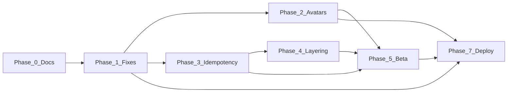

# Codebase remediation plan

**Document version:** 1.4  
**Last updated:** 2026-10-04  
**Status:** Active — implementation tracker for gaps found in the 2026-10 codebase review  
**Architecture reference:** [platform-architecture.md](platform-architecture.md)  
**Conventions:** [development.md](development.md)

This plan fixes identified gaps **without breaking v1 features**. Work follows platform principles: Postgres only via API, thin HTTP / fat domain, client display encode + signed GCS URLs, durable idempotent async work, secrets in Secret Manager, observable structured logs.

---

## Executive summary

The repo matches the intended **Flutter → JWT API → Postgres** and **GCS → Pub/Sub → worker** shape. Highest-risk gaps: **worker notification idempotency**, **account delete ordering**, **avatar URLs vs signed-read policy**, **mobile baby-context / signed-URL TTL** bugs, **layering drift** on invites/onboarding, and **API/worker notification channel duplication**.

Remediation is split into **phases 0–7** (code phases 0–6, then **Phase 7** deploy and ship). Merge in dependency order (see [PR sequence](#suggested-pr-sequence)).

---

## Findings by severity

### P0 — Reliability / duplicate side effects (principle #5)

| Issue | Evidence | Impact |
|--------|-----------|--------|
| Notification handlers not idempotent | Worker `notifications.py` inserts new rows with `uuid.uuid4()` per delivery; 500 → Pub/Sub retry | Duplicate inbox rows and FCM |
| Weekly digest not guarded by `last_weekly_digest_at` | Eligibility does not prevent duplicate cron/Pub/Sub runs | Spam weekly pushes |
| Thumbnail ready vs notify split | `mark_photo_ready` idempotent; notify after; retry after `ready` may skip notify | Missing “new photo” push |

### P1 — Security / data integrity / product bugs

| Issue | Area | Notes |
|--------|------|--------|
| Account delete: SQL before Firebase | `services/api/.../domain/account_delete.py` | Firebase failure → anonymized SQL but live Firebase user |
| Avatar URLs vs media policy | `storage.py` `smoke/{uid}/…`; mobile stores public GCS URL | Private buckets → 403; diverges from signed reads for gallery |
| Announcement owner UI uses selected baby, not route `babyId` | `announcement_card_screen.dart` | Dual-baby owners lose edit on deep link |
| Signed URL TTL (900s) gaps | Announcement, event detail, birth welcome | No `onSignedUrlError` refresh |
| Invite accept: DB then fragile notify | Not `safe_enqueue_fan_out` | Accept OK, side effects fail |
| App Check: silent missing token | Client omits header when token null | Breaks when `APP_CHECK_ENFORCE=true` |

### P2 — Architecture drift, ops, docs

| Issue | Notes |
|--------|--------|
| Thin handlers / fat repos on invitations, onboarding, first-moment | Contradicts development.md layering |
| First-moment seed vs fun domain name limits | Unlimited seed vs follower limits |
| In-process rate limits | Not shared across Cloud Run instances |
| `firebase_audiences` unused in JWT verify | Dead config or missing enforcement |
| 500 responses may echo `str(exc)` | `http_errors.py` / broad `except Exception` |
| Worker/API duplication | `_CHANNEL_COLUMNS` vs `NotificationChannel`; activity writes in both |
| Maestro / proxy port doc drift | Fixed in Phase 0 where possible |
| `GET /v1/app/version` | Documented in Phase 0 |

### P3 — Hygiene

- Flutter `use_build_context_synchronously`, theme hex in onboarding/invitations.
- Email-templates README vs sync script template list.
- Worker `invite_email.py` duplicates DB connect vs `db.py`.
- Optional `packages/server-domain` for shared notify/invite helpers.

### Healthy (no remediation required for v1 scope)

- Migrations **001–020** on disk; email template CI `check`.
- Gallery display encode + `photos/init`; centralized `ApiClient`; invite `lanonna://` cold start.
- Core domain tests for gallery, calendar, registry, fun, home.

---

## Phase 0 — Baseline (docs + truth)

**Goal:** Safe ground for refactors. **No product behavior changes.**

| Task | Status |
|------|--------|
| This document (`remediation-plan.md`) | Done |
| `GET /v1/app/version` in [development.md](development.md) route table | Done |
| Maestro README: smoke paths, `run-maestro.sh` vs full suite | Done |
| Worker README: `apply-dev-run-iam.sh` from repo root | Done |
| Migration references **001–020** in engineering docs | Done |
| `verify-dev-migrations.sh` header + spot-check `020` | Done |
| Email-templates README: templates actually synced | Done |
| Link from [engineering/README.md](README.md) | Done |

### Regression gate (run before each later phase)

```bash
# From repository root
cd apps/mobile && flutter pub get && flutter analyze && flutter test
pip install -r services/api/requirements.txt
PYTHONPATH=services/api/src pytest -q services/api/tests
pip install -r services/worker/requirements.txt pytest
PYTHONPATH=services/worker/src python -m compileall services/worker/src
PYTHONPATH=services/worker/src pytest -q services/worker/tests
bash scripts/sync-email-templates.sh check
```

**Local DB proxy:** Prefer port **5433** when **5432** is taken (`DB_PORT=5433`). Maestro, `clear_dev_test_data.py`, and `verify-dev-migrations.sh` default to **5433**; `apply_migrations.py` defaults to **5432** — set `DB_PORT` explicitly.

---

## Phase 1 — Correctness fixes (small PRs)

**Goal:** Targeted correctness fixes with tests. **Status: complete (2026-10-04).**

| # | Work | Status |
|---|------|--------|
| 1.1 | Announcement owner — `HomeRepository.babyById` for route `babyId` | Done |
| 1.2 | Signed URL refresh — `onSignedUrlError` on announcement, event detail, birth welcome | Done |
| 1.3 | Account delete — Firebase `delete_user` before SQL; 503 if Firebase fails | Done |
| 1.4 | Invite accept notify — `safe_enqueue_notify_user` after accept commit | Done |
| 1.5 | Invite accept HTTP — 404/410/403/409 + mobile `ApiException.detail` mapping | Done |

**Key touchpoints:** `announcement_card_screen.dart`, `home_repository.dart`, `domain/account_delete.py`, `routers/invitation_accept.py`, `domain/notifications.py` (`safe_enqueue_notify_user`), `api_client.dart` / `invitations_repository.dart`. Tests: `test_account_delete.py`, `test_invitation_accept.py`, `home_repository_test.dart`, `invitations_repository_test.dart`.

---

## Phase 2 — Media / avatars (architectural alignment)

**Status: complete (2026-10-04).**

| Item | Status |
|------|--------|
| Upload paths `avatars/users/…` and `avatars/babies/{id}/…` | Done |
| DB stores object path; normalize legacy public GCS + `smoke/` on write | Done |
| Signed read on `GET /v1/me/account`, baby list/patch (`signed_avatar_url`) | Done |
| Mobile persists `object_path`; baby upload uses `scope=baby` | Done |
| Avatar preview `CachedSignedImage` + stale URL refresh on edit screens | Done |

Code complete; rollout steps are in [Phase 7 — Deploy & ship](#phase-7--deploy--ship-to-dev--beta).

---

## Phase 3 — Worker idempotency (principle #5)

**Status: complete (2026-10-04).**

| Handler | Mechanism | Duplicate behavior |
|---------|-----------|-------------------|
| `notify_user` / `notify_fan_out` | `worker_delivery_log` via Pub/Sub `messageId` or payload `dedupe_key` | Skip inbox + FCM |
| `send_invite_email` | `invitations.email_sent_at` after Mailjet success | Skip send |
| `weekly_notification_digest` | Pub/Sub message dedupe + `last_weekly_digest_at` (7-day window) | Skip user / batch |
| `baby_data_export` | `UPDATE … WHERE status = 'pending'` claim | Skip re-entrancy |
| Photo ready + notify | `photo_ready_notification_log` + notify even when `mark_photo_ready` no-ops | One fan-out per generation |

**Migration:** `021_worker_idempotency.sql`. **Deploy:** apply migration → worker → `apply-dev-run-iam.sh` ([Phase 7](#phase-7--deploy--ship-to-dev--beta)).

---

## Phase 4 — Layering cleanup (incremental)

**Status: complete (2026-10-04).**

1. `domain/invitations.py` — preview, accept, batch, revoke.
2. `domain/onboarding.py` + first-moment; share fun name limits.
3. Move `assert_owner_membership` to domain.
4. Keep `domain/home.py` as read-model aggregator.

**New code rule:** routers → domain → repositories; GCS/Pub/Sub from domain or thin adapters.

**Shared channels:** Extend `test_notification_channel_parity.py`; defer `packages/server-domain` until Phase 3 is stable.

---

## Phase 5 — Beta hardening

**Status: partial (2026-10-04)** — App Check **enforce** deferred while sideload/emulator testing (`APP_CHECK_ENFORCE=false` on dev).

| Item | Action | Status |
|------|--------|--------|
| App Check | `APP_CHECK_ENFORCE=true` on staging; mobile retry + user-visible error; [pre-beta-qa.md](pre-beta-qa.md) §1 | **Deferred** (sideload beta) |
| Rate limiting | Document per-instance limit; Cloud Armor / Redis when scaling | Done (docs only) |
| JWT audiences | Wire or remove `firebase_audiences` | Done |
| 500 sanitization | Generic client message; log + `request_id` | Done |
| FCM deep links | Add `/invite-accept` to allowlist | Done |
| Maestro | Register omitted flows in `run-maestro-full.sh` (`announce_arrival`, `registry_mark_purchased`, `registry_ai_suggestion_add`) | Done |

After Phase 3 lands, use [Phase 7](#phase-7--deploy--ship-to-dev--beta) for the full deploy sequence (migration → worker → API → mobile).

---

## Phase 6 — Optional / longer term

- `packages/server-domain` for notify payloads, invite URLs, activity types.
- Structured logs binding `X-Request-Id`.
- Onboarding theme hex → `core/theme`.
- `use_build_context_synchronously` fixes.

---

## Phase 7 — Deploy & ship (to dev / beta)

**Goal:** Land remediation code on **lanonna-dev** (and later beta/prod) in a safe order, verify backends, then ship the Flutter app. Run after the code phases you are releasing are merged to `main`.

### 7.1 Pre-flight (every release)

| Step | Action |
|------|--------|
| CI | `main` green (Flutter analyze/test, API + worker pytest, email template `check`) |
| Regression | [Phase 0 regression gate](#regression-gate-run-before-each-later-phase) locally if you touched API/mobile/worker |
| GCP context | `gcloud config set project lanonna-dev` (see [initial-setup.md](initial-setup.md)) |
| Gate script | `./scripts/verify-dev-prerequisites.sh` (optional but recommended) |

### 7.2 Database (when migrations changed)

1. Cloud SQL Auth Proxy: `cloud-sql-proxy lanonna-dev:us-central1:lanonna-db --port 5433` (or `5432`).
2. From `infra/db`: `DB_PASSWORD=… DB_PORT=5433 python apply_migrations.py` ([migrations/README.md](../../infra/db/migrations/README.md)).
3. Optional: `./scripts/verify-dev-migrations.sh` with `PGPASSWORD` set.

**Note:** Apply migration **`021_worker_idempotency`** before deploying worker builds that include Phase 3.

### 7.3 Backend deploy order

Always **worker before or with API** when both change; re-apply Run IAM after worker image changes.

| Order | Service | Command | Follow-up |
|-------|---------|---------|-----------|
| 1 | Email templates (if changed) | `bash scripts/sync-email-templates.sh apply` from repo root | Worker image includes copied templates on next deploy |
| 2 | **Worker** | `services/worker/scripts/deploy.sh` | `../../scripts/apply-dev-run-iam.sh` from repo root |
| 3 | **API** | `services/api/scripts/deploy.sh` | Confirm URL: `gcloud run services describe api --region=us-central1 --format='value(status.url)'` |

**Phase-specific API notes (already on `main`):**

- **Phase 1:** Invite accept returns **HTTP 4xx** — deploy API **before** testing accept flows on a new mobile build.
- **Phase 2:** Avatars return **signed read URLs**; DB may still hold legacy `smoke/` paths — API dual-reads until users re-upload.

**App Check (Phase 5 / beta):** Default dev deploy keeps `APP_CHECK_ENFORCE=false` in `deploy.sh`. Before wide beta, redeploy with enforce on and complete [pre-beta-qa.md](pre-beta-qa.md) §1.

**Smoke:** `./scripts/infra-smoke-display-upload.sh` (gallery path); curl `GET /health` and authenticated `GET /v1/me/account` with a dev JWT.

### 7.4 Mobile — dev install

1. Sync **`API_BASE_URL`** in `apps/mobile/flavors/dev.json` with the live Run URL ([flavors/README.md](../../apps/mobile/flavors/README.md)).
2. Local run: `cd apps/mobile && flutter run --dart-define-from-file=flavors/dev.json`.
3. Android APK for testers: `apps/mobile/maestro/scripts/build-install.sh` (or your release build pipeline).
4. **Maestro smoke** (proxy + credentials): `./maestro/scripts/run-maestro-smoke.sh`; before beta, `run-maestro-full.sh` once green.

### 7.5 Store / force-update (when ready for wider beta)

| Step | Action |
|------|--------|
| `app_versions` | Ensure migration **`020`** applied; set `minimum_version` / `store_url` in SQL or ops tooling |
| Client | `GET /v1/app/version` + Flutter `AppVersionGate` ([building-the-app.md](building-the-app.md)) |
| Beta gate | `./scripts/run-beta-gate.sh` (tests + optional API deploy) |
| Manual QA | [pre-beta-qa.md](pre-beta-qa.md) full checklist |

### 7.6 Post-ship verification (remediation-focused)

- [ ] Account edit + baby edit: upload avatar → persists; image loads after navigate away/back (signed URL refresh).
- [ ] Invite accept: wrong email → 403 UX; valid accept → home/onboarding (API 4xx contract).
- [ ] Gallery / home teasers: stale thumb recovery after ~15 min or `onSignedUrlError` (Phase 1).
- [ ] Account delete: blocked when sole owner; success removes Firebase + SQL (Phase 1).

### 7.7 Project documentation sync

After each remediation release, bring **project docs** in line with what shipped (do not leave engineering docs describing pre-remediation behavior). Phase 0–2 already updated [development.md](development.md) and this plan; later phases still need explicit passes.

| Doc | When to update |
|-----|----------------|
| [development.md](development.md) | API routes, mobile conventions (`babyById`, avatars, Maestro), DB port notes |
| [platform-architecture.md](platform-architecture.md) | Media pipeline (avatars under `avatars/`, signed reads), migration ceiling, dev snapshot bullets |
| [building-the-app.md](building-the-app.md) / [engineering/README.md](README.md) | Prerequisite gate, “done on dev” snapshot, beta gate steps |
| [pre-beta-qa.md](pre-beta-qa.md) | Manual QA steps when behavior or deploy flags change (App Check, avatars, invite accept) |
| [infra/db/migrations/README.md](../../infra/db/migrations/README.md) | New migration rows (e.g. `021`) |
| [product/README.md](../product/README.md) | Dev alignment paragraph if user-visible scope changed |
| Service READMEs | `services/api/README.md`, `services/worker/README.md` — deploy, templates, env |
| **This plan** | Mark completed phases in [Completion logs](#completion-logs); adjust Phase 7 checklist if process changes |

**Task:** Before closing a Phase 7 release, walk the table for every code phase included in the release. If a doc already matches `main`, note “no change” in the completion log; otherwise open a small docs PR (or same release PR) so `docs/` stays the source of truth.

### Phase 7 completion log

_Use after a remediation release is on dev (or beta)._

- [x] Migrations applied (version: **021_worker_idempotency**, 2026-10-04)
- [x] Worker revision deployed + `apply-dev-run-iam.sh` (**worker-00009-pth**)
- [x] API revision deployed; `dev.json` URL verified (**api-00037-cmw**, `https://api-r27szgit5q-uc.a.run.app`)
- [ ] Mobile build tested against dev API
- [ ] Maestro smoke (and full gate if beta)
- [ ] pre-beta-qa sections relevant to this release
- [ ] **7.7** Project docs reviewed/updated (list files touched: _____)

---

## Suggested PR sequence



| PR | Scope | Risk |
|----|--------|------|
| **PR-A** | Phase 0 docs | None |
| **PR-B** | Phase 1.1–1.2 mobile | Low |
| **PR-C** | Phase 1.3–1.5 API | Medium |
| **PR-D** | Phase 3 worker + migration 021 | Medium |
| **PR-E** | Phase 2 avatars E2E | Medium–high |
| **PR-F** | Phase 4 invitations domain | Medium |
| **PR-G** | Phase 5 App Check + errors | Ops + mobile |
| **Release** | [Phase 7](#phase-7--deploy--ship-to-dev--beta) deploy API/worker + ship mobile | Ops |

---

## What not to do

- Do not expose Postgres or bypass membership checks during refactors.
- Do not change gallery `display/{photo_id}` / thumb worker regex without a migration plan.
- Do not set `APP_CHECK_ENFORCE=true` in prod before Phase 5 mobile ships.
- Do not big-bang all routers to domain in one PR.

---

## Verification per phase

| Layer | Commands / manual |
|--------|------------------|
| API | `pytest services/api/tests` |
| Worker | `pytest services/worker/tests`; double-delivery tests after Phase 3 |
| Mobile | `flutter test`; pre-beta-qa §3, §6, §7 |
| E2E | `./apps/mobile/maestro/scripts/run-maestro-smoke.sh`; full gate: `run-maestro-full.sh` |
| Infra | `apply_migrations.py` on dev; `./scripts/run-beta-gate.sh` before beta |
| **Ship** | [Phase 7](#phase-7--deploy--ship-to-dev--beta) — deploy order, mobile, checklists |

---

## Completion logs

### Phase 0 — completed 2026-10-04

Docs-only; no product code changes.

- [x] `remediation-plan.md` created
- [x] Route table includes `GET /v1/app/version`
- [x] Maestro + worker README aligned
- [x] Engineering docs reference migrations through `020`
- [x] `verify-dev-migrations.sh` updated for `020`

### Phase 1 — completed 2026-10-04

API + mobile correctness; deploy API before wide testing of invite accept (4xx contract).

- [x] **1.1** Announcement owner uses `babyById(widget.babyId)`, not selected-baby match
- [x] **1.2** Stale signed URLs: `onSignedUrlError` on keepsake card, event cover, birth welcome card
- [x] **1.3** `delete_account`: Firebase first, then `soft_delete_account_rows`; no SQL if Firebase fails
- [x] **1.4** `safe_enqueue_notify_user` on invite accept (notify failure does not fail HTTP)
- [x] **1.5** `POST /v1/invitations/accept` errors as HTTP 4xx; mobile maps `detail` to `InvitationAcceptResult`
- [x] Tests added/updated (API + Flutter) per [development.md](development.md) regression gate

### Phase 2 — completed 2026-10-04

- [x] `domain/avatar_urls.py` — normalize storage, sign reads, legacy GCS URL dual-read
- [x] `mint_user_avatar_upload_url` / `mint_baby_avatar_upload_url`; upload API `scope` + `baby_profile_id`
- [x] Mobile `display_photo_upload.dart` returns `object_path`; `uploadBabyAvatar`
- [x] `PrototypePhotoUpload` uses `CachedSignedImage` with `onSignedUrlError` on account/baby edit
- [x] `test_avatar_urls.py` + development.md route notes

### Phase 3 — completed 2026-10-04

- [x] Migration `021_worker_idempotency.sql`
- [x] `lanonna_worker/idempotency.py` + delivery / photo-ready claims
- [x] Notifications, invite email, weekly digest, export job claim, thumbnail notify path
- [x] `services/worker/tests/test_idempotency.py`

### Phase 4 — completed 2026-10-04

- [x] `domain/membership.py` — `assert_owner_membership`, `require_owner_baby`; repo `owner_membership_exists`
- [x] `domain/invitations.py` — owner list/revoke/batch, preview/accept (+ post-accept notify)
- [x] `domain/onboarding.py` — status, owner complete, `seed_first_moment`; thin `repositories/first_moment.py`
- [x] `domain/name_suggestions.py` — shared name/gender normalization for fun + first-moment seed
- [x] Routers `invitations`, `invitation_accept`, `onboarding`, babies first-moment → domain
- [x] `test_invitations_domain.py`, `test_onboarding_domain.py`; notification channel parity assertion

### Phase 5 — partial 2026-10-04

- [x] JWT `aud` check via `firebase_audience_allowlist()` (`test_auth_audience.py`)
- [x] 500 sanitization in `map_domain_errors` + global handler (`test_http_errors.py`)
- [x] FCM/inbox `/invite-accept` in `normalizeAppDeepLinkPath`
- [x] Maestro full suite: announce arrival, registry purchased, registry AI add
- [x] Rate limit per-instance documented in [development.md](development.md)
- [ ] App Check enforce + mobile hardening (when leaving sideload-only testing)
